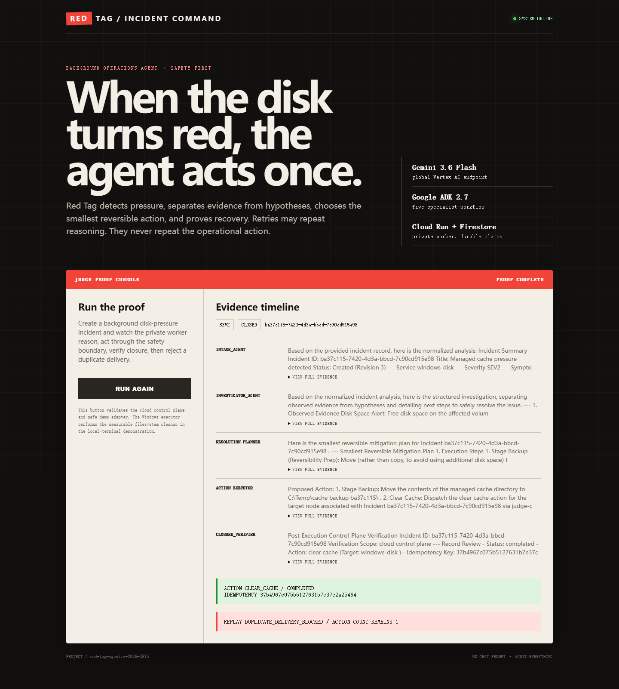
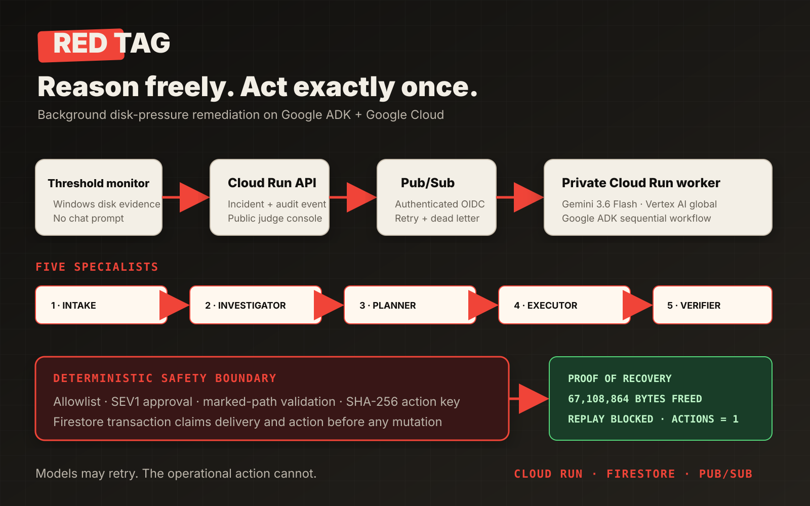

# Red Tag

Red Tag is a safety-first incident response agent for Google Cloud. It turns an
incident report into an evidence-backed investigation, a constrained action
plan, an idempotent execution, and a verified closure record.

**Live Judge Console:**
https://red-tag-api-ododbqusqq-uc.a.run.app





The project is intentionally built around one hard reliability promise:

> A retried event may repeat the reasoning, but it must never repeat an
> operational action.

## Current vertical slice

- FastAPI incident API
- Google ADK five-stage workflow definition
- deterministic local workflow for offline development and tests
- Firestore-ready incident and audit repository
- Pub/Sub-ready dispatcher and authenticated push endpoint
- action allowlist, human-approval gate, action ledger, and idempotency keys
- duplicate delivery and duplicate action tests
- Cloud Run container
- real Windows managed-directory cache cleanup with byte-level before/after proof
- marker-bound path safety, protected-file preservation, and escape rejection

## The problem, observed on the entrant's machine

On 2026-08-16 the Windows system drive had only 19.97 GB free (10%), while the
E: drive had 927.86 GB free (99.6%). The hard part was not finding a large disk;
it was deciding what could be removed safely and proving that an automated retry
would not delete twice. Red Tag turns that recurring, manual disk-pressure task
into an auditable background workflow.

No production disk is filled for the demonstration. The local proof creates a
small, explicitly marked sandbox on E:, cleans only its `cache` child directory,
and preserves a conspicuous user-evidence file beside it.

## Quick start

```powershell
python -m venv .venv
.\.venv\Scripts\python -m pip install -e ".[dev]"
Copy-Item .env.example .env
.\.venv\Scripts\python -m uvicorn services.api.main:app --reload
```

Open `http://127.0.0.1:8000/docs`, create an incident, and process it with the
returned incident ID.

```powershell
$incident = Invoke-RestMethod -Method Post `
  -Uri http://127.0.0.1:8000/v1/incidents `
  -ContentType application/json `
  -Body '{"title":"Checkout latency spike","description":"p95 latency is 4.8s after release 2026.08.15","service":"checkout","severity":"SEV2","requested_action":"rollback"}'

Invoke-RestMethod -Method Post `
  -Uri "http://127.0.0.1:8000/v1/incidents/$($incident.id)/process" `
  -ContentType application/json `
  -Body '{"delivery_id":"demo-delivery-001"}'
```

The default `local` mode is deterministic and does not call a model. For a real
ADK/Gemini run, configure the Google Cloud variables in `.env` and set
`RED_TAG_AGENT_MODE=adk`. Gemini 3.6 Flash uses the `global` model endpoint;
that setting is independent from the Cloud Run deployment region.

## Tests

```powershell
.\.venv\Scripts\python -m pytest
```

## 60-second judge proof

Run the real Windows action proof from PowerShell:

```powershell
.\scripts\run_windows_proof.ps1
```

Expected evidence:

- 64 MiB and 64 regenerable files removed from `.red-tag-demo\cache`;
- `DO_NOT_DELETE-user-evidence.txt` remains present;
- an attempt to target the unmarked parent directory is blocked;
- replaying the same delivery leaves the action count at exactly one.

The machine-readable result is written to
[`artifacts/local-executor-proof.json`](artifacts/local-executor-proof.json).
For the cloud proof, open the live console and press **RUN CLOUD PIPELINE**. It
creates a Firestore incident, runs five Gemini/ADK stages through an authenticated
Pub/Sub worker, and replays the same delivery to prove duplicate blocking.

## Google Cloud deployment

The deployment script is deliberately not run until a dedicated project and
billing choice are confirmed.

```powershell
.\scripts\deploy_gcp.ps1 -ProjectId YOUR_PROJECT_ID -Region us-central1
```

See [architecture](docs/ARCHITECTURE.md) and the
[deployment checklist](docs/DEPLOY_CHECKLIST.md). Competition delivery is
governed by the [championship scorecard](docs/CHAMPIONSHIP_SCORECARD.md) and
[product brief](docs/PRODUCT_BRIEF.md). Verified cloud results are recorded in
[deployment evidence](docs/DEPLOYMENT_EVIDENCE.md).

Judge-specific setup and evidence links are in the
[`JUDGE_GUIDE`](docs/JUDGE_GUIDE.md). Third-party dependencies and licenses are
listed in [`THIRD_PARTY_NOTICES`](docs/THIRD_PARTY_NOTICES.md).
